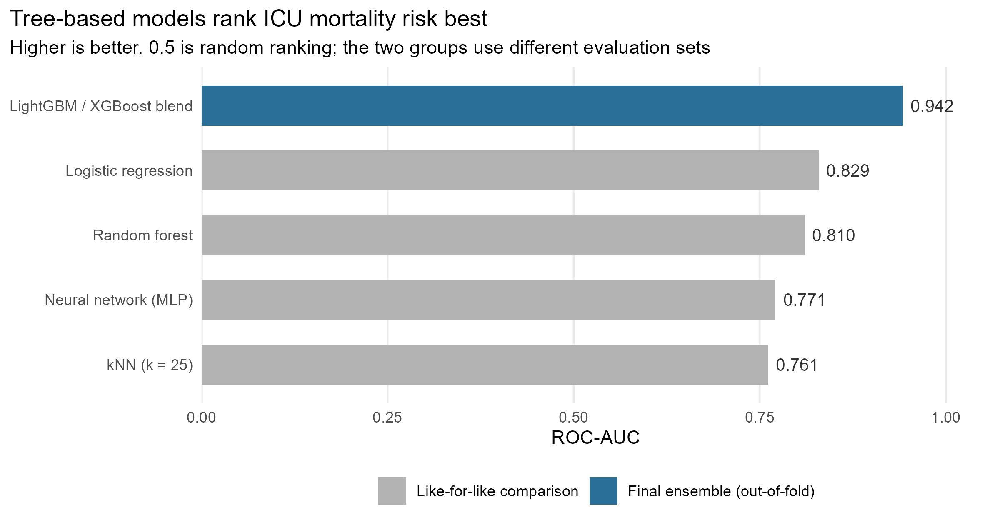

## The question

Given only what is known about a patient at the moment they arrive in intensive
care, how well can we predict whether they will die before discharge? The purpose
is triage rather than explanation - ranking patients so that limited clinical
attention flows toward the people most likely to need it.

The work was set as a Kaggle competition for a machine learning unit,
using a preprocessed extract of MIMIC-III: one row per ICU stay, first-day vitals
and demographics, with the main diagnosis as an ICD-9 code and comorbidities in a
separate table. Four model families were mandated - logistic regression, kNN, a
decision tree method and a neural network - and the grade was tied to ROC-AUC on a
hidden test set in bands, topping out at 0.94.

Two details of that setup shaped the whole approach. Submissions had to be
probabilities, not classes, so nothing could be tuned to a threshold. And the
leaderboard only ever revealed the score on half the test set; the mark came from
the other half, never seen.

## Data and cleaning

MIMIC-III ICU stays, one row per admission. Predictors are first-day vital signs
summarised as min, max and mean (heart rate, blood pressures, respiratory rate,
temperature, SpO2, glucose), demographics and admission details, plus a separate
diagnoses table of ICD-9 codes keyed on admission ID. The outcome,
`HOSPITAL_EXPIRE_FLAG`, is positive for roughly 11.2% of stays. The core vitals
had no missingness.

Three parts needed care:

**Age had to be reconstructed.** MIMIC shifts the date of birth of any patient over
89 roughly 300 years into the past as a de-identification measure, so a naive
`ADMITTIME - DOB` returns ages in the hundreds. Ages were capped at 90 with an
indicator flag retained, since membership of that group is itself informative.

**The diagnosis columns were unusable raw.** Free-text `DIAGNOSIS` held about 5,000
unique values and behaved as an ID column, so it was dropped. The 555 distinct
ICD-9 codes were rolled into the ~17 standard chapters, and for the boosting pass
also multi-hot encoded over the 300 most common codes, joined at admission level
alongside a diagnosis count as a comorbidity proxy.

**Encodings had to survive the train/test boundary.** Factor levels were fitted on
train and applied to test so the one-hot columns aligned, with unseen test levels
resolving to `NA` rather than silently shifting columns.

Derived features carried more signal than raw levels: per-vital ranges
(`Max - Min`), shock index (`HeartRate_Mean / SysBP_Mean`) and pulse pressure. A
heart rate of 110 means something different at a systolic pressure of 140 than at
80.

The age fix and the derived vitals happen in one pass, applied identically to
train and test. Note `AGE_OVER_89` is kept after capping: the fact that a patient
was old enough to be date-shifted is itself a signal, so discarding it would
throw away information the de-identification accidentally encodes.

```{r}
#| label: feature-engineering
fe_basic <- function(df) {
  df |>
    mutate(
      age_days    = as.numeric(difftime(ADMITTIME, DOB, units = "days")),
      AGE         = pmin(pmax(age_days / 365.25, 0), 90),
      AGE_OVER_89 = as.integer(age_days / 365.25 > 89),

      HeartRate_Range = HeartRate_Max - HeartRate_Min,
      SysBP_Range     = SysBP_Max     - SysBP_Min,
      RespRate_Range  = RespRate_Max  - RespRate_Min,
      SpO2_Range      = SpO2_Max      - SpO2_Min,

      ShockIndex    = HeartRate_Mean / na_if(SysBP_Mean, 0),
      PulsePressure = SysBP_Mean - DiasBP_Mean
    ) |>
    select(-DOB, -ADMITTIME, -Diff, -DIAGNOSIS, -age_days)
}
```

`na_if(SysBP_Mean, 0)` is small but load-bearing: a recorded systolic pressure of
zero would otherwise divide through to `Inf` rather than a missing value.

The 555 distinct ICD-9 codes are reduced two ways at once - a coarse chapter
rollup that generalises, and a multi-hot over the 300 most common codes that
preserves detail. Both are keyed on admission rather than ICU stay:

```{r}
#| label: diagnosis-features
# Coarse rollup: ICD-9 code prefix to standard disease chapter
icd_chapter <- function(code) {
  out <- rep("UNK", length(code))
  out[substr(code, 1, 1) == "V"] <- "V_supp"
  out[substr(code, 1, 1) == "E"] <- "E_extcause"
  n <- suppressWarnings(as.integer(substr(code, 1, 3)))
  bands <- list(
    c(1, 139, "infectious"),   c(140, 239, "neoplasm"),
    c(390, 459, "circulatory"), c(460, 519, "respiratory"),
    c(800, 999, "injury")       # ... 17 chapters in full
  )
  for (b in bands) {
    sel <- !is.na(n) & n >= as.integer(b[1]) & n <= as.integer(b[2]) & out == "UNK"
    out[sel] <- b[3]
  }
  out
}

# Fine detail: multi-hot over the 300 most frequent codes
top_codes <- diag |> count(ICD9_CODE, sort = TRUE) |>
  slice_head(n = 300) |> pull(ICD9_CODE)

diag_wide <- diag |>
  filter(ICD9_CODE %in% top_codes) |>
  distinct(HADM_ID, ICD9_CODE) |>
  mutate(val = 1L, ICD9_CODE = paste0("icd_", ICD9_CODE)) |>
  pivot_wider(names_from = ICD9_CODE, values_from = val, values_fill = 0L)
```

The `distinct()` before `pivot_wider()` matters - a code listed twice for one
admission would otherwise collide during the widening rather than resolving to a
single indicator.

Encoding is the step most likely to fail silently. Levels are fitted on train and
applied to test, so an unseen test level becomes `NA` instead of quietly shifting
every column to its right:

```{r}
#| label: categorical-encoding
for (c in cat_cols) {
  lev <- unique(train_fe[[c]])
  # -1L because factor() codes from 1, while LightGBM wants categoricals from 0
  train_fe[[c]] <- as.integer(factor(train_fe[[c]], levels = lev)) - 1L
  test_fe[[c]]  <- as.integer(factor(test_fe[[c]],  levels = lev)) - 1L
}
```

[View the code and data on GitHub](https://github.com/tlabagala/your-repo)

## Method, and why this one

The project ran in two passes. The first held preprocessing fixed - rare-level
consolidation, one-hot encoding, then standardisation - and swapped only the model,
so any difference in score was attributable to the model family rather than to the
features. Five families were compared: logistic regression, kNN at k = 25, a random
forest, a 16-unit single-layer MLP, and XGBoost.

That controlled comparison rests on one recipe, defined once and reused by every
workflow. Step order is not arbitrary: `step_other()` must precede `step_dummy()`
so rare levels are merged before any indicator columns exist, and
`step_normalize()` is what stops Glucose, on a 0-1500 scale, from dominating the
distance metric that kNN and the MLP depend on.

```{r}
#| label: recipe
icu_recipe_5m <-
  recipe(HOSPITAL_EXPIRE_FLAG ~ ., data = train_set_5m) |>
  step_other(all_nominal_predictors(), threshold = 0.1, other = "other") |>
  step_dummy(all_nominal_predictors(), one_hot = TRUE) |>
  step_normalize(all_numeric_predictors())
```

With preprocessing pinned, only the model specification varies:

```{r}
#| label: model-specs
logistic_spec_5m <- logistic_reg() |> set_engine("glm")

knn_spec_5m <- nearest_neighbor(neighbors = 25, weight_func = "rectangular") |>
  set_engine("kknn")

rf_spec_5m <- rand_forest(mtry = 5, trees = 500, min_n = 10) |>
  set_engine("ranger", importance = "impurity", probability = TRUE)

nn_spec_5m <- mlp(hidden_units = 16, penalty = 0.01, epochs = 200) |>
  set_engine("nnet", MaxNWts = 10000, trace = FALSE)

# scale_pos_weight rebalances the 11% positive rate
xgb_spec_5m <- boost_tree(trees = 900, tree_depth = 4, learn_rate = 0.02,
                          min_n = 20, loss_reduction = 10, sample_size = 0.6) |>
  set_engine("xgboost", scale_pos_weight = pos_w_5m)
```

Only XGBoost scores rows containing `NA` natively. For the other four, the
complete-case test rows are scored and the remainder fall back to the base rate,
which is honest about the uncertainty rather than imputing a value the model was
never shown.

The second pass took the winning family and pushed it: richer diagnosis features,
repeated stratified cross-validation over 3 seeds x 5 folds with early stopping,
and a 70/30 blend of LightGBM and XGBoost. Repeating the folds across seeds matters
at an 11% positive rate, where a single 5-fold partition carries enough sampling
noise to move the estimated AUC on its own.

The outer loop over seeds is the whole point - fifteen fits rather than five, with
out-of-fold predictions averaged across seeds so the estimate does not hinge on one
lucky partition:

```{r}
#| label: lightgbm-cv
lgb_params <- list(
  objective = "binary", metric = "auc",
  learning_rate = 0.03, num_leaves = 63L, min_data_in_leaf = 40L,
  feature_fraction = 0.85, bagging_fraction = 0.85, lambda_l2 = 1.0
)

for (seed in c(42L, 123L, 2024L)) {
  fold_idx <- make_folds(y, N_SPLITS, seed)   # stratified on the outcome
  seed_oof <- rep(0, length(y))

  for (k in seq_along(fold_idx)) {
    va <- fold_idx[[k]]
    tr <- setdiff(seq_along(y), va)

    dtr <- lgb.Dataset(X[tr, ], label = y[tr], categorical_feature = cat_cols)
    dva <- lgb.Dataset(X[va, ], label = y[va], categorical_feature = cat_cols,
                       reference = dtr)

    m <- lgb.train(c(lgb_params, list(seed = seed)), dtr, nrounds = 4000L,
                   valids = list(val = dva), early_stopping_rounds = 100L)

    seed_oof[va] <- predict(m, X[va, ])       # each row scored by a model
    test_lgb     <- test_lgb + predict(m, X_test)   # that never saw it
  }
  oof_lgb <- oof_lgb + seed_oof
}
```

Categorical features are passed to LightGBM **by name**, not index - R counts from
1 and LightGBM from 0, and a silent off-by-one there would mislabel which columns
are categorical without ever raising an error.

The blend weight came from the centre of the flat region of the weight sweep rather
than its argmax, since picking the exact peak of a noisy curve is a quiet form of
overfitting the validation set:

```{r}
#| label: blend-search
blend_grid <- tibble(w_lgb = seq(0.30, 0.85, by = 0.05)) |>
  mutate(auc = map_dbl(w_lgb, \(w)
    as.numeric(auc(roc(y, w * oof_lgb + (1 - w) * oof_xgb, quiet = TRUE)))))

W_LGB      <- 0.70          # centre of the plateau, not the argmax
final_test <- W_LGB * test_lgb + (1 - W_LGB) * test_xgb
```

Boosting rather than a linear model because clinical risk is threshold-like - an
SpO2 below 88 is categorically bad - which trees represent natively and a linear
predictor only approximates. Two boosting libraries rather than one because
LightGBM grows trees leaf-wise and XGBoost level-wise, so their errors are partly
decorrelated and the average beats either alone.

> Logistic regression beat the neural network. On tabular data of this size, model
> capacity is not free - the extra flexibility has to be paid for in data, and here
> it could not be afforded.

## Findings

::: {.column-page}
{.figure-wide}
:::

Within the controlled comparison the ordering was kNN 0.761, MLP 0.771, random
forest ~0.81, logistic regression 0.829. Logistic regression finishing ahead of the
neural network says mortality risk is broadly additive and monotonic in these
inputs, which is exactly the structure a linear-in-log-odds model captures most
efficiently. The kNN result is structural rather than a tuning failure: after
one-hot encoding the space is sparse enough that distances concentrate, and a
25-patient neighbourhood contains under three deaths on average.

The final blend reached 0.942 out-of-fold. That number is not comparable to the
four above it - it comes from a different evaluation scheme on a feature set
several hundred columns wider, so much of the gap is features rather than
algorithm.

## Assumptions and limitations

**Folds were stratified on the outcome, not grouped by patient.** Splitting happened
at ICU-stay level. If a patient contributes more than one stay, their rows can land
in different folds and the model can effectively memorise them, inflating the
out-of-fold estimate. Patient-level splitting via `group_vfold_cv()` is the fix. I
have not quantified how much repeat admission exists in this extract, so I do not
know the size of the effect.

**Diagnosis codes are not available at hour zero.** ICD-9 codes are assigned over
the stay and finalised at discharge, so using them to predict that stay's outcome
is defensible as a retrospective benchmark but would not transfer to real-time use.

**Logistic regression assumes independent observations and linearity in the
log-odds.** The first is questionable for the same repeat-admission reason; the
second was not formally checked.

**The probabilities are ranked, not calibrated.** Rebalancing the positive class
distorts the output scale and averaging fifteen models compresses it toward the
middle. PR-AUC was computed alongside ROC-AUC, which is the right instinct at an
11% base rate, but no calibration plot was produced.

None of this licenses a claim that any feature causes mortality, or that acting on
the model would change an outcome. It supports one claim only: the ranking is
informative.
